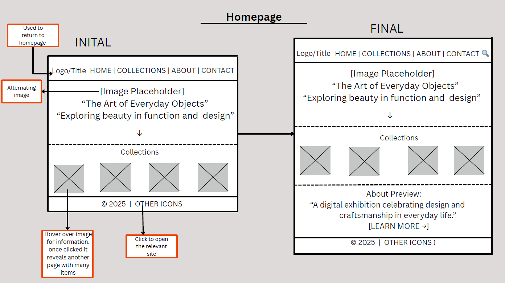
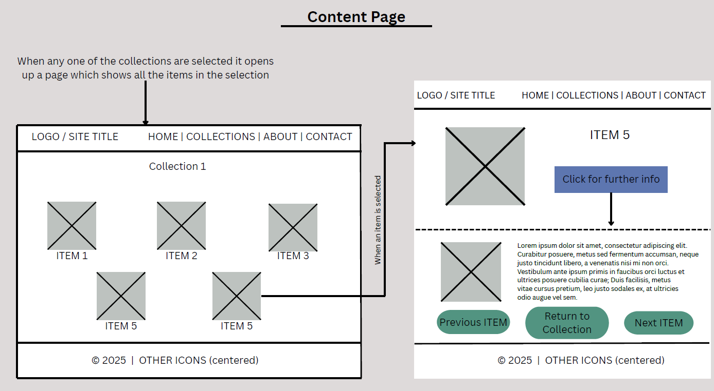

 

Please click Ctrl+Shift+v to view both images

This project allowed me to design and develop a multi-page website that displays four different collections and items that fall in those respective categories. Looking back at my original low-fidelity prototypes, I can clearly see how my ideas evolved during development and where I made changes to improve the site’s structure and usability, and where I had to cut ideas short as they were not practical to complete. 

One of the major changes that I made was removing the "Collections" button from the top navigation bar. In my prototype, I  originally included this menu item, but once I created the homepage, I found that the user can already access all the collections there itself, so a collections button at the top was redundant. Due to this, I decided to keep the navigation simple with only HOME and CONTACT buttons. 

Another planned feature that I did not end up implementing was the "More Info" button in the Content Page. The plan was that once a user clicked on a specific item, they could click the button to move the item to the silde, reveling all information about the item. I discarded this idea as it was quite complicated to complete with the time restrictions and becuase I wanted to remain visually consistent across all the pages. Similarly, I also removed the “Next Item,” “Previous Item,” and “Return to Collection” buttons that were part of the prototype. Instead, each item displays its information directly on the page.

One intentional design choice I kept was that Item 6 in every collection links to an additional page that reveals further details about that specific item. I included this to demonstrate an example of a deeper item-level page, giving the site one extra layer of navigation without overwhelming the user. Futhermore, doing this for all the items would make the code extremely repetitive. (Note: All the other items cannot be clicked)

Throught the project, I enountered several challenges. One example was getting my Contact page's "Send message" button to work. At first, all the send message button did was reset the name, email and comment written by the user, but it did not give any message to convey to the user that their message has been sent. At first it didn’t respond because my JavaScript had small spelling errors like getElementById and addEventListener. After learning how to correctly structure the form and script, I solved the problem and gained confidence in debugging HTML and JavaScript issues.

Overall, the website is quite similar to the wireframes I designed, however a few features did have to be cut due to time constrictions, complexity and the redundancy of the feature. If I were to continue developing the site, I has plans to adding more user interactivity and refining some of the features that I had originally planned. 

References (Apa 7):

1. Typewriter | writing technology. (2018). In Encyclopædia Britannica. https://www.britannica.com/technology/typewriter

2. W3schools. (2019). How To Create a Contact Form with CSS. W3schools.com. https://www.w3schools.com/howto/howto_css_contact_form.asp 
 
3. OpenAI. (2025). ChatGPT. ChatGPT; OpenAI. https://chatgpt.com/

‌

